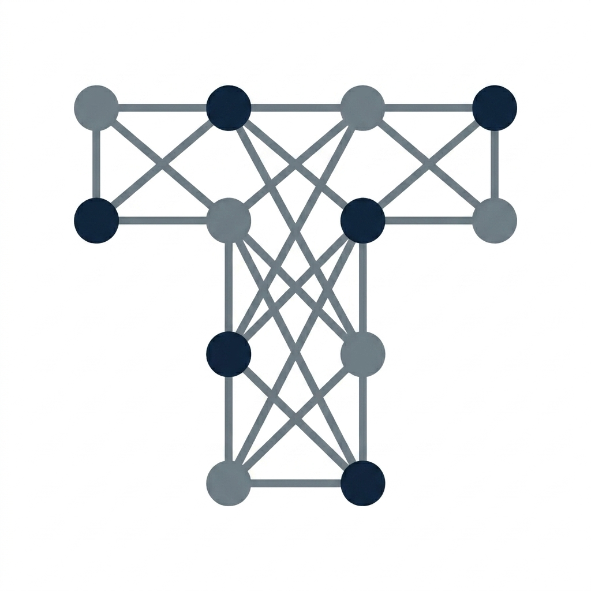

# 🪐 ContextFlow: Local-First Developer Hyper-Context Engine

<p align="center">
  
</p>

> **[English](./README.md) | [한국어](./README.ko.md)**

ContextFlow는 개발자의 작업 맥락(파일 변경, Git Diff, 터미널 명령어 및 종료 코드)을 로컬 환경의 SQLite 데이터베이스에 영구적이고 안전하게 적재하고, 이를 기반으로 최적의 작업 요약, 구현 계획 및 자동화된 에러 복구 패치(Agentic Fix)를 제안하는 **로컬 우선(Local-first) 지능형 개발 흐름 추적 엔진**입니다.

모든 민감 데이터 분석과 파일 감시는 초고속 Rust 코어 데몬(`daemon-rust`)이 네이티브 수준에서 전담하여 자원 소모를 극대화로 줄였으며, VS Code Extension과의 네이티브 연동을 통해 IDE 상에서 바로 강력한 AI 컨텍스트를 활용할 수 있습니다.

---

## 📖 목차
1. [핵심 기술 아키텍처 및 특징](#1-핵심-기술-아키텍처-및-특징)
2. [설치 및 환경 설정 (Setup Guide)](#2-설치-및-환경-설정-setup-guide)
3. [데몬 기동 및 셸 훅 등록 (Daemon Setup)](#3-데몬-기동-및-셸-훅-등록-daemon-setup)
4. [핵심 CLI 명령어 사용법 (Usage & CLI Commands)](#4-핵심-cli-명령어-사용법-usage--cli-commands)
5. [실전 활용 시나리오 및 예시 (Examples)](#5-실전-활용-시나리오-및-예시-examples)
6. [안전한 시크릿 프라이버시 가드 (RAG Privacy & Safety)](#6-안전한-시크릿-프라이버시-가드-rag-privacy--safety)

---

## 1. 핵심 기술 아키텍처 및 특징

* **초경량 로컬 네이티브 엔진**: 전체 엔진이 단일 **Rust 네이티브 바이너리**로 설계·구현되어, 백그라운드 상시 구동 중에도 메모리 점유율 10MB 이하 및 CPU 사용량 1% 미만의 압도적인 자원 최적화를 실현했습니다.
* **비동기 스레드 풀 스케줄러**: `Tokio` 비동기 런타임 위에서 `Axum` HTTP 통신 포트와 OS 네이티브 `Notify` 파일 와처를 동시 기동합니다.
* **동시성 격리 데이터베이스**: 모든 이벤트 이력은 `memory.db` 파일에 SQLite 표준으로 적재되며, 데이터베이스 입출력 병목으로 인한 스레드 고사(Starvation)를 완벽히 차단하기 위해 동기식 DB 작업은 `tokio::task::spawn_blocking` 경계 내부로 안전 격리하였습니다.
* **프라이버시 세이프 프롬프트 가드**: AI 클라우드로 RAG 컨텍스트를 전송하기 전, 정규식 기반 `PrivacyFilter`가 프롬프트 평문 내부의 API 키, Bearer 보안 토큰, 사설 비밀키를 실시간 스캔 및 마스킹 처리하여 절대 유출되지 않도록 방어합니다.

---

## 2. 설치 및 환경 설정 (Setup Guide)

### 2.1 자격 증명 설정 (API Key)
사용하고자 하는 인공지능 프로바이더(기본값: Gemini, 폴백: OpenAI)의 API 키를 시스템 환경 변수에 등록하거나, 루트 경로의 `.env` 파일에 기록합니다.

```env
# .env 파일 규격
GEMINI_API_KEY="your_real_gemini_key_here"
OPENAI_API_KEY="your_openai_api_key_here"
```

### 2.2 로컬 설정 파일 구성 (`.contextflow.json`)
프로젝트의 세부 작동 방식을 커스터마이징하려면 프로젝트 루트 디렉토리에 `.contextflow.json` 파일을 개설합니다.

```json
{
  "provider": "gemini",
  "model": "gemini-2.5-flash",
  "baseUrl": "https://generativelanguage.googleapis.com",
  "port": 49152
}
```

---

## 3. 데몬 기동 및 셸 훅 등록 (Daemon Setup)

ContextFlow의 파일 와처와 데이터 수집기는 언제나 대상 **프로젝트 루트 경로**에서 시작되어야 합니다.

### 3.1 데몬 기동
로컬 터미널에서 컴파일된 Rust 코어 바이너리를 실행하여 감시 데몬을 활성화합니다.
```bash
# 디렉토리 이동 후 데몬 시작
cd ContextFlow
./daemon-rust/target/release/daemon-rust start
```

### 3.2 셸 훅 (Shell Hook) 등록 가이드
터미널에서 내리는 모든 명령어와 명령어의 성공/실패 여부(Exit Code)를 자동으로 수집하기 위해, 사용 중인 셸 설정 파일 끝에 셸 훅 스크립트를 연동합니다.

#### Zsh 사용자의 경우 (`~/.zshrc` 끝부분에 추가):
```zsh
# ContextFlow Shell Event Hook (CF_PATH는 실제 설치 폴더 경로로 치환하여 사용합니다)
CF_PATH="/path/to/ContextFlow"

chpwd_contextflow() {
  # 디렉토리 변경 시 파일 이벤트 전송
  bash "$CF_PATH/scripts/shell-hook.sh" "dir_change" "$PWD" 0
}
precmd_contextflow() {
  local exit_status=$?
  if [ -n "$LAST_CMD" ]; then
    # 실행이 끝난 명령어와 종료 코드를 데몬에 적재
    bash "$CF_PATH/scripts/shell-hook.sh" "terminal_command" "$LAST_CMD" "$exit_status"
    unset LAST_CMD
  fi
}
preexec_contextflow() {
  # 실행할 명령어 임시 보존
  LAST_CMD="$1"
}
add-zsh-hook chpwd chpwd_contextflow
add-zsh-hook precmd precmd_contextflow
add-zsh-hook preexec preexec_contextflow
```

---

## 4. 핵심 CLI 명령어 사용법 (Usage & CLI Commands)

데몬이 활성화된 상태에서 아래 CLI 도구 명령어를 활용하여 로컬 인텔리전스 분석을 제어합니다. (바이너리는 프로젝트 루트에서 실행 가능합니다)

### 4.1 데몬 및 작동 세션 상태 조회
```bash
./daemon-rust/target/release/daemon-rust status
```
* **결과 예시**:
  ```text
  --- ContextFlow Daemon Status ---
  Status: Active (listening on localhost)
  Active Session: cf_lru_cache_refactoring
  Total Stored Events: 142
  Database Path: .contextflow\memory.db
  ---------------------------------
  ```

### 4.2 로컬 설정 동적 변경
```bash
# 프로바이더를 OpenAI로 변경
./daemon-rust/target/release/daemon-rust config --set provider=openai

# 현재 모델 조회
./daemon-rust/target/release/daemon-rust config --get model
```

### 4.3 실시간 작업 요약 및 RAG 구현 계획서 도출
* **Summarize**: 최근 30개의 코딩 행위 맥락을 바탕으로 기술 요약 노트를 작성합니다.
  ```bash
  ./daemon-rust/target/release/daemon-rust summarize
  ```
* **Plan**: 축적된 맥락을 토대로 다음 단계 구현 마크다운 계획서를 자동 생성합니다.
  ```bash
  ./daemon-rust/target/release/daemon-rust plan
  ```

### 4.4 에러 자동 분석 및 패치 제안 (Agentic Fix)
마지막 터미널 명령어 실패(Exit Code > 0) 혹은 현재 소스 코드의 이상 상태를 감지하여 구체적인 해결 패치를 제시합니다.
```bash
./daemon-rust/target/release/daemon-rust fix
```

---

## 5. 실전 활용 시나리오 및 예시 (Examples)

### 💡 예시 1: 컴파일 에러 즉시 교정 (Agentic Fix)
개발자가 프로그램 빌드 명령(`cargo build`)을 내렸으나 에러가 나면서 프로세스가 종료코드 `1`로 끝났을 때:
1. 셸 훅이 종료코드 `1`을 감지하여 데몬으로 `terminal_command` 이벤트(metadata에 `exitCode: 1` 포함)를 보냅니다.
2. 개발자가 `./daemon-rust/target/release/daemon-rust fix` 명령(또는 VS Code 단축키 `Fix with AI`)을 실행합니다.
3. ContextFlow가 최근 에러가 발생한 원인 파일인 `src/main.rs` 소스 코드 컨텍스트와 함께 AI에게 분석을 요청합니다.
4. 아래와 같이 명확한 **SEARCH/REPLACE 규격의 로컬 패치**를 화면에 즉시 추천합니다:
   ```text
   🤖 Requesting agentic fix recommendation...
   
   --- Recommended Fix ---
   에러의 원인은 main.rs 321라인에서 String의 소유권이 moved된 후 재참조된 것에 있습니다. 
   아래와 같이 .clone()을 추가하여 해결하세요:
   
   <<<<<<< SEARCH
   let value = config.provider;
   println!("Provider: {}", value);
   =======
   let value = config.provider.clone();
   println!("Provider: {}", value);
   >>>>>>> REPLACE
   ```

### 💡 예시 2: 다중 세션 작업 복원 (Session Resume)
휴가 복귀 후 혹은 다른 브랜치에서 긴급 핫픽스를 마치고 본 작업 세션으로 복귀했을 때:
1. `cf_main_feature` 세션을 재활성화합니다.
2. `./daemon-rust/target/release/daemon-rust summarize`를 실행하면, 과거의 전체 타임라인과 Git diff를 기억하고 있는 AI가 다음과 같이 현재 의도를 파악하고 복원 제안을 내립니다.
   ```text
   📝 Analyzing real-time context (Events: 85)
   
   어제 작업하시던 'LRU 캐시 메모리 무결성 테스트'의 최종 수정 단계로 돌아왔습니다. 
   가장 마지막 파일 감시 이력에 따르면 src/db.rs의 테스트 모듈이 아직 빌드되지 않은 상태입니다. 
   'cargo test'를 즉시 기동하여 검증을 이행하는 것을 추천합니다.
   ```

---

## 6. 안전한 시크릿 프라이버시 가드 (RAG Privacy & Safety)

ContextFlow는 보안에 매우 민감한 상용 프로젝트에서도 안전하게 사용할 수 있도록 **강력한 프라이버시 샌드박스**를 가지고 있습니다.

개발자의 모든 작업 컨텍스트(소스 코드 파일 상태, 셸 명령어)는 인텔리전스 프로바이더로 전송되기 직전 `PrivacyFilter` 모듈([privacy.rs](./daemon-rust/src/intelligence/privacy.rs))을 통과합니다.

* **API Keys & Passwords**: `(?i)(api[_-]?key|secret|password|token)\s*[:=]\s*...` 정규식 감지를 통해 API 키나 패스워드 평문 값이 평문 컨텍스트 밖으로 누출되는 것을 차단하고 `[REDACTED_SECRET]`으로 난독화 교체합니다.
* **Bearer 암호화 헤더**: 웹 통신이나 토큰 테스트 명령어에 포함된 JWT Bearer 정보는 즉각 `Bearer [REDACTED_BEARER]`로 중화 처리됩니다.
* **Private SSH Keys**: 로컬 사설 키 파일 내용이나 암호화 키 페어 블록이 파일 와처를 타고 들어가더라도, RAG 송신 전 자동으로 탐지하여 `[REDACTED_PRIVATE_KEY]`로 원천 봉쇄합니다.

---
© 2026 Trisoft. All rights reserved. (Docs folder excluded for draft isolation.)
